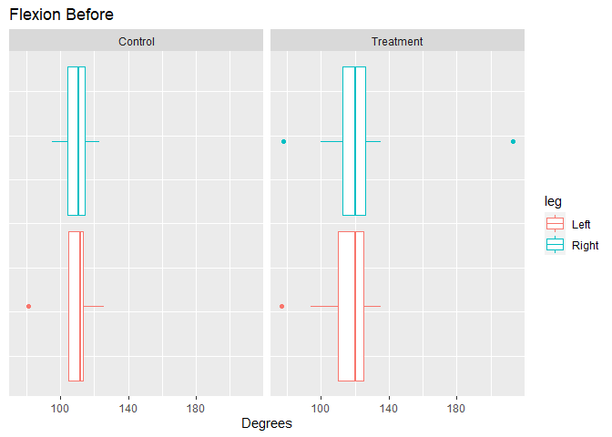
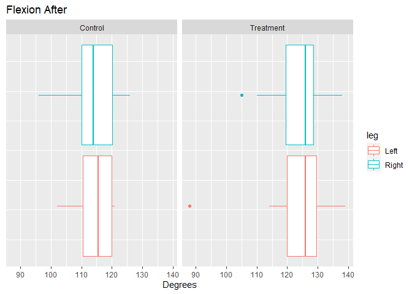
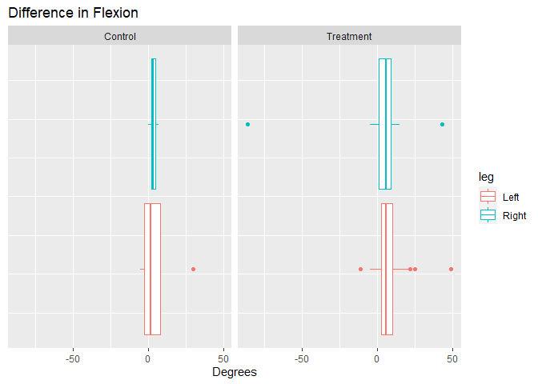
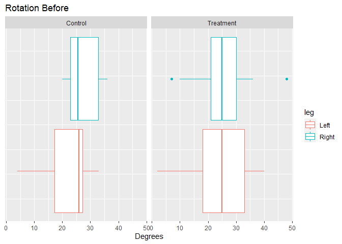
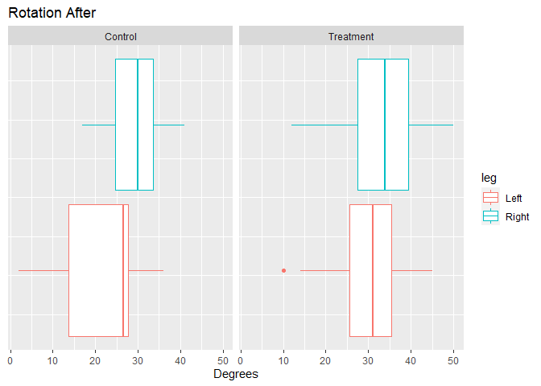
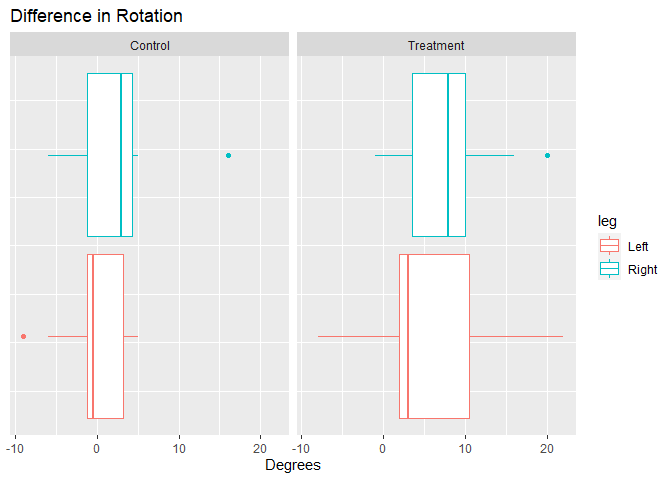

Group Project 1
================

## Loading packages/read data

``` r
library(tidyverse)
library(here)

arthritis <- read_csv(here::here("data", "arthritis_clean.csv"))
```

## Summarize flexion before

``` r
arthritis %>% 
  group_by(leg, Group) %>%
  summarise(min = min(Flexion_Before), Q1 = quantile(Flexion_Before, .25),
            median = median(Flexion_Before), Q3 = quantile(Flexion_Before, .75),
            max = max(Flexion_Before), std = sd(Rotation_Before)) %>% 
  knitr::kable()
```

| leg   | Group     | min |    Q1 | median |    Q3 | max |      std |
|:------|:----------|----:|------:|-------:|------:|----:|---------:|
| Left  | Control   |  81 | 105.0 |  112.0 | 113.5 | 126 | 8.520919 |
| Left  | Treatment |  77 | 110.0 |  120.0 | 125.0 | 135 | 9.799413 |
| Right | Control   |  95 | 104.5 |  110.5 | 114.5 | 123 | 5.913518 |
| Right | Treatment |  78 | 113.0 |  120.0 | 126.0 | 213 | 8.995409 |

``` r
arthritis %>% 
  ggplot(aes(x = Flexion_Before, color = leg))+
  geom_boxplot()+
  facet_grid(cols = vars(Group))+
  labs(title = "Flexion Before",
       x = "Degrees",
       y = NULL)+
  theme(axis.text.y = element_blank(),
        axis.ticks.y = element_blank())
```

<!-- --> It
looks like participants in the treatment group had greater mobility
already than those in the control group. Worth testing to see if it’s
significant.

## Summarize Flexion After

``` r
arthritis %>% 
  group_by(leg, Group) %>%
  summarise(min = min(Flexion_After), Q1 = quantile(Flexion_After, .25),
            median = median(Flexion_After), Q3 = quantile(Flexion_After, .75),
            max = max(Flexion_After), std = sd(Flexion_After)) %>% 
  knitr::kable()
```

| leg   | Group     | min |    Q1 | median |     Q3 | max |      std |
|:------|:----------|----:|------:|-------:|-------:|----:|---------:|
| Left  | Control   | 102 | 110.5 |  115.5 | 120.00 | 121 | 6.734691 |
| Left  | Treatment |  88 | 120.0 |  126.0 | 129.50 | 139 | 9.982035 |
| Right | Control   |  96 | 110.0 |  114.0 | 120.25 | 126 | 8.979353 |
| Right | Treatment | 105 | 119.5 |  126.0 | 128.50 | 138 | 8.973052 |

``` r
arthritis %>% 
  ggplot(aes(x = Flexion_After, color = leg))+
  geom_boxplot()+
  facet_grid(cols = vars(Group))+
  labs(title = "Flexion After",
       x = "Degrees",
       y = NULL)+
  theme(axis.text.y = element_blank(),
        axis.ticks.y = element_blank())
```

<!-- -->

## summarize diff\_flexion

``` r
arthritis %>% 
  group_by(leg, Group) %>% 
  summarise(min = min(diff_Flexion), Q1 = quantile(diff_Flexion, .25),
            median = median(diff_Flexion), Q3 = quantile(diff_Flexion, .75),
            max = max(diff_Flexion), std = sd(diff_Flexion)) %>% 
  knitr::kable()
```

| leg   | Group     | min |    Q1 | median |  Q3 | max |       std |
|:------|:----------|----:|------:|-------:|----:|----:|----------:|
| Left  | Control   |  -5 | -2.25 |    2.0 |   8 |  30 |  9.633826 |
| Left  | Treatment | -11 |  2.50 |    6.0 |  10 |  49 | 11.236388 |
| Right | Control   |   0 |  2.50 |    3.5 |   5 |   7 |  2.269695 |
| Right | Treatment | -86 |  1.00 |    6.0 |   9 |  43 | 19.809420 |

``` r
arthritis %>% 
  ggplot(aes(x = diff_Flexion, color = leg))+
  geom_boxplot()+
  facet_grid(cols = vars(Group))+
  labs(title = "Difference in Flexion",
       x = "Degrees",
       y = NULL)+
  theme(axis.text.y = element_blank(),
        axis.ticks.y = element_blank())
```

<!-- --> The
treatment appears to have increase flexion mobility by 4 degrees in the
left leg and 2.5 degrees in the right leg.

## Summarize Rotation Before

``` r
arthritis %>% 
  group_by(leg, Group) %>% 
  summarise(min = min(Rotation_Before), Q1 = quantile(Rotation_Before, .25),
            median = median(Rotation_Before), Q3 = quantile(Rotation_Before, .75),
            max = max(Rotation_Before), std = sd(Rotation_Before)) %>% 
  knitr::kable()
```

| leg   | Group     | min |    Q1 | median |    Q3 | max |      std |
|:------|:----------|----:|------:|-------:|------:|----:|---------:|
| Left  | Control   |   4 | 17.25 |   26.0 | 27.25 |  33 | 8.520919 |
| Left  | Treatment |   2 | 18.00 |   25.0 | 33.00 |  40 | 9.799413 |
| Right | Control   |  20 | 22.75 |   25.5 | 32.75 |  36 | 5.913518 |
| Right | Treatment |   7 | 21.00 |   25.0 | 30.00 |  48 | 8.995409 |

``` r
arthritis %>% 
  ggplot(aes(x = Rotation_Before, color = leg))+
  geom_boxplot()+
  facet_grid(cols = vars(Group))+
  labs(title = "Rotation Before",
       x = "Degrees",
       y = NULL)+
  theme(axis.text.y = element_blank(),
        axis.ticks.y = element_blank())
```

<!-- --> The
median rotation for both hips and for treatment groups is similar.

## Summarize Rotation After

``` r
arthritis %>% 
  group_by(leg, Group) %>% 
  summarise(min = min(Rotation_After), Q1 = quantile(Rotation_After, .25),
            median = median(Rotation_After), Q3 = quantile(Rotation_After, .75),
            max = max(Rotation_After), std = sd(Rotation_After)) %>% 
  knitr::kable()
```

| leg   | Group     | min |    Q1 | median |    Q3 | max |      std |
|:------|:----------|----:|------:|-------:|------:|----:|---------:|
| Left  | Control   |   2 | 13.75 |   26.5 | 27.75 |  36 | 9.903703 |
| Left  | Treatment |  10 | 25.50 |   31.0 | 35.50 |  45 | 8.284988 |
| Right | Control   |  17 | 24.75 |   30.0 | 33.50 |  41 | 6.431457 |
| Right | Treatment |  12 | 27.50 |   34.0 | 39.50 |  50 | 9.257630 |

``` r
arthritis %>% 
  ggplot(aes(x = Rotation_After, color = leg))+
  geom_boxplot()+
  facet_grid(cols = vars(Group))+
  labs(title = "Rotation After",
       x = "Degrees",
       y = NULL)+
  theme(axis.text.y = element_blank(),
        axis.ticks.y = element_blank())
```

<!-- --> The
treatment group appears to have increase roation in both hips compared
to the control group.

## Summarize diff\_rotation

``` r
arthritis %>% 
  group_by(leg, Group) %>% 
  summarise(min = min(diff_Rotation), Q1 = quantile(diff_Rotation, .25),
            median = median(diff_Rotation), Q3 = quantile(diff_Rotation, .75),
            max = max(diff_Rotation), std = sd(diff_Rotation)) %>% 
  knitr::kable()
```

| leg   | Group     | min |    Q1 | median |    Q3 | max |      std |
|:------|:----------|----:|------:|-------:|------:|----:|---------:|
| Left  | Control   |  -9 | -1.25 |   -0.5 |  3.25 |   5 | 4.158780 |
| Left  | Treatment |  -8 |  2.00 |    3.0 | 10.50 |  22 | 7.022755 |
| Right | Control   |  -6 | -1.25 |    3.0 |  4.25 |  16 | 5.828353 |
| Right | Treatment |  -1 |  3.50 |    8.0 | 10.00 |  20 | 5.549313 |

``` r
arthritis %>% 
  ggplot(aes(x = diff_Rotation, color = leg))+
  geom_boxplot()+
  facet_grid(cols = vars(Group))+
  labs(title = "Difference in Rotation",
       x = "Degrees",
       y = NULL)+
  theme(axis.text.y = element_blank(),
        axis.ticks.y = element_blank())
```

<!-- -->
treatment appears to have improved rotation in both legs more than in
the control group. The difference in the right leg is quite a bit
larger.

## Things to test

-   Is there a significant difference between the treatment and control
    group’s initial flexion/rotation
-   Is there a significant difference in difference after intervention
    between the treatment groups in flexion/rotation
-   Does leg matter

## The Test

-   Mann-Whitney Test

### Assumptions

-   One dependent variable (continuous or Ordinal)
    -   We have a continuous variable (flexion/rotation)
-   One independent variable (categorical, independent)
    -   Treatment and Control, Right and Left Leg
-   Independence of observations \*measures are for each leg. Comparing
    left and right leg is likely not independent. I’m not sure about
    comparing between treatment/control
    -   possible solution would be to average the rotation/flexion
        between each patient’s legs
-   Distributions have kind of similar shapes/spreads \*can test medians
    -   if not same shape/spread can only test for distribution

## Is there a difference between treatment group’s inital flexion/rotation

clean data

``` r
flex_crl <- arthritis$Flexion_Before[arthritis$Group =='Control']
flex_trt <- arthritis$Flexion_Before[arthritis$Group =='Treatment']

rot_crl <- arthritis$Rotation_Before[arthritis$Group =='Control']
rot_trt <- arthritis$Rotation_Before[arthritis$Group =='Treatment']
```

test flexion

``` r
wilcox.test(flex_crl, flex_trt)
```

    ## 
    ##  Wilcoxon rank sum test with continuity correction
    ## 
    ## data:  flex_crl and flex_trt
    ## W = 381.5, p-value = 0.003939
    ## alternative hypothesis: true location shift is not equal to 0

``` r
median(flex_crl)
```

    ## [1] 112

``` r
median(flex_trt)
```

    ## [1] 120

The Distribution between the treatment and control groups for their
initial flexion is different

test rotation

``` r
wilcox.test(rot_crl, rot_trt)
```

    ## 
    ##  Wilcoxon rank sum test with continuity correction
    ## 
    ## data:  rot_crl and rot_trt
    ## W = 665, p-value = 0.858
    ## alternative hypothesis: true location shift is not equal to 0

``` r
median(rot_crl)
```

    ## [1] 26

``` r
median(rot_trt)
```

    ## [1] 25

We cannot say that the distributions between the treatment and control
groups for the patients’ inital rotation are different.

## Is there a difference in flexion/rotation after treatment between the groups?

clean data

``` r
flex_diff_ctr <- arthritis$diff_Flexion[arthritis$Group == "Control"]
flex_diff_trt <- arthritis$diff_Flexion[arthritis$Group == "Treatment"]

rot_diff_ctr <- arthritis$diff_Rotation[arthritis$Group == "Control"]
rot_diff_trt <- arthritis$diff_Rotation[arthritis$Group == "Treatment"]
```

test flexion

``` r
wilcox.test(flex_diff_ctr, flex_diff_trt)
```

    ## 
    ##  Wilcoxon rank sum test with continuity correction
    ## 
    ## data:  flex_diff_ctr and flex_diff_trt
    ## W = 455, p-value = 0.03669
    ## alternative hypothesis: true location shift is not equal to 0

``` r
median(flex_diff_ctr)
```

    ## [1] 3

``` r
median(flex_diff_trt)
```

    ## [1] 6

The distributions of the difference in flexion between the control and
treatment group are significantly different

test rotation

``` r
wilcox.test(rot_diff_ctr, rot_diff_trt)
```

    ## 
    ##  Wilcoxon rank sum test with continuity correction
    ## 
    ## data:  rot_diff_ctr and rot_diff_trt
    ## W = 318.5, p-value = 0.0003566
    ## alternative hypothesis: true location shift is not equal to 0

``` r
median(rot_diff_ctr)
```

    ## [1] 1.5

``` r
median(rot_diff_trt)
```

    ## [1] 5

The distributions for the difference in rotation between the control and
treatment group are significantly different.

## Does Leg Matter

I think we can do this by treating it as paired data. We can make a
vector of the difference in all the left legs and do the same for the
right legs. To do this we will have to find out what leg belongs to what
patient. I assume leg 1 and 2 belong to patient one. 3 and 4 to patient
two and so on.

cleaning

``` r
diff_flex_crt_l <- arthritis$diff_Flexion[arthritis$Group == "Control" & arthritis$leg == "Left"]
diff_flex_crt_r <- arthritis$diff_Flexion[arthritis$Group == "Control" & arthritis$leg == "Right"]

diff_flex__trt_l <- arthritis$diff_Flexion[arthritis$Group == "Treatment" & arthritis$leg == "Left"]
diff_flex_trt_r <- arthritis$diff_Flexion[arthritis$Group == "Treatment" & arthritis$leg == "Right"]

diff_rot_crt_l <- arthritis$diff_Rotation[arthritis$Group == "Control" & arthritis$leg == "Left"]
diff_rot_crt_r <- arthritis$diff_Rotation[arthritis$Group == "Control" & arthritis$leg == "Right"]

diff_rot_trt_l <- arthritis$diff_Rotation[arthritis$Group == "Treatment" & arthritis$leg == "Left"]
diff_rot_trt_r <- arthritis$diff_Rotation[arthritis$Group == "Treatment" & arthritis$leg == "Right"]
```

test flexion control

``` r
wilcox.test(diff_flex_crt_l, diff_flex_crt_r)
```

    ## Warning in wilcox.test.default(diff_flex_crt_l, diff_flex_crt_r): cannot compute
    ## exact p-value with ties

    ## 
    ##  Wilcoxon rank sum test with continuity correction
    ## 
    ## data:  diff_flex_crt_l and diff_flex_crt_r
    ## W = 64.5, p-value = 0.6845
    ## alternative hypothesis: true location shift is not equal to 0

``` r
median(diff_flex_crt_l)
```

    ## [1] 2

``` r
median(diff_flex_crt_r)
```

    ## [1] 3.5

We cannot conclude that the distributions for the difference in flexion
for the control group is different between legs.

test flexion treatment

``` r
wilcox.test(diff_flex__trt_l, diff_flex_trt_r)
```

    ## Warning in wilcox.test.default(diff_flex__trt_l, diff_flex_trt_r): cannot
    ## compute exact p-value with ties

    ## 
    ##  Wilcoxon rank sum test with continuity correction
    ## 
    ## data:  diff_flex__trt_l and diff_flex_trt_r
    ## W = 393.5, p-value = 0.6211
    ## alternative hypothesis: true location shift is not equal to 0

``` r
median(diff_flex__trt_l)
```

    ## [1] 6

``` r
median(diff_flex_trt_r)
```

    ## [1] 6

We cannot conclude that the distributions for the difference in flexion
for the treatment group is different between legs.

test rotation control

``` r
wilcox.test(diff_rot_crt_l, diff_rot_crt_r)
```

    ## Warning in wilcox.test.default(diff_rot_crt_l, diff_rot_crt_r): cannot compute
    ## exact p-value with ties

    ## 
    ##  Wilcoxon rank sum test with continuity correction
    ## 
    ## data:  diff_rot_crt_l and diff_rot_crt_r
    ## W = 55.5, p-value = 0.3521
    ## alternative hypothesis: true location shift is not equal to 0

``` r
median(diff_rot_crt_l)
```

    ## [1] -0.5

``` r
median(diff_rot_crt_r)
```

    ## [1] 3

We cannot conclude that the distributions for the difference in rotation
for the control group is different between legs

test rotation treatment

``` r
wilcox.test(diff_rot_trt_l, diff_rot_trt_r)
```

    ## Warning in wilcox.test.default(diff_rot_trt_l, diff_rot_trt_r): cannot compute
    ## exact p-value with ties

    ## 
    ##  Wilcoxon rank sum test with continuity correction
    ## 
    ## data:  diff_rot_trt_l and diff_rot_trt_r
    ## W = 285, p-value = 0.1705
    ## alternative hypothesis: true location shift is not equal to 0

``` r
median(diff_rot_trt_l)
```

    ## [1] 3

``` r
median(diff_rot_trt_r)
```

    ## [1] 8

We cannot conclude that the distributions for the difference in rotation
for the treatment group is different between legs

all of this said, the sample size may be too small to draw any
meaningful conclusions about an suspected different between leg.
